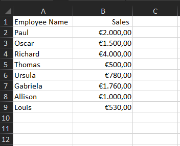
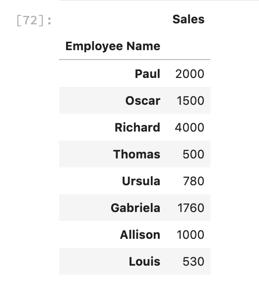
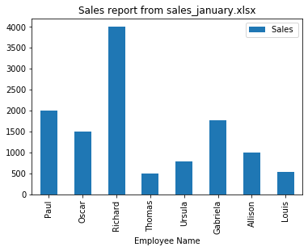
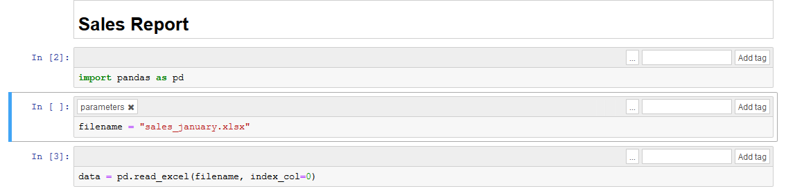
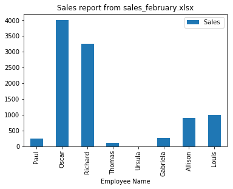

# Automating report generation with Papermill and Rclone: Part 1 - Tool roundup

[Duarte Carmo](https://duarteocarmo.com/) is a product manager and digital consultant at [Jabra](https://www.jabra.com/). He is originally from Lisbon - Portugal, but currently lives and works in Copenhagen - Denmark. Find more about his work in [his blog](https://duarteocarmo.com/). 

Welcome to this two part series post about automating report generation using python, jupyter, papermill, and a couple of other tools. 

In the first part, we will cover 4 main important processes that are part of the automation process. In the second and final part, we will bring everything together and build our report automation system. 


Before you begin, please note that all the code was written in python 3.7 and that you might have to adapt the code for older versions of python.

## Automating report generation with Python

Not everyone can code. This might seem like an obvious statement, but once you start using python to automate or analyze things around you, you start to encounter a big problem: reproducability. By this I mean the fact that not everyone can/ knows how to run your scripts, use your tools, etc. 

Let us say you built a killer script. How exactly do you make someone who has never heard the word "python" use it? You could teach them python, but that would take a long time.

In this post, we will cover how you can automatically generate shareable html reports from any excel file using a combination of tools, centered around python.  

So sit tight, and let's get started. 

## Creating a jupyter notebook report from an excel file

Let us say you have an excel file (`sales_january.xlsx`) with a list of the sales generated by a group of employees. Just like this:

<br/>
<center>

</center>
<br/>

Let's start by using a jupyter notebook `sales_january.ipynb` to create a very simple analysis of that sales data. 

We start by importing the [pandas](https://pandas.pydata.org/) library. After that we define the name of our file using the `filename` variable. Finally, we use the `read_excel` function to read our data into a pandas dataframe. 

```python
import pandas as pd
import matplotlib.pyplot as plt
%matplotlib inline

filename = "sales_january.xlsx"
data = pd.read_excel(filename, index_col=0)
```
When printing the `data` dataframe, we get the following:

<br/>
<center>

</center>
<br/>

After that, we simply plot the data using: 

```python
data.plot(kind="bar", title=f"Sales report from {filename}")
```

And get the following:

<br/>
<center>

</center>
<br/>

And that's it! We got ourselves a jupyter notebook that analyzes (a very simple example here) a sales report in excel. Now let's say we want to share that report with other people in the organization, what do we do? 

notebook link!
[Browse the notebook here!]()


## Generating html reports from Jupyter Notebooks to share with colleagues

In my experience, the easiest way to share a report with colleagues is to use a little tool called [nbconvert](https://nbconvert.readthedocs.io/en/latest/). Nbconvert allows you to generate an html version of your notebook. To do this, start by navigating to the same directory where your notebook is and run the following from your terminal: 

```bash
$ jupyter nbconvert sales_january.ipynb
```
You will see a new file named `sales_january.html` was created. HTML files are better than `ipynb` in the measure that they are easily shareable via email, message, or any other way. 

But lets us say that this sales report comes in every month, how can we automatically run this notebook with any excel file in the same format? 

## Automating report generation using papermill

[Papermill](https://papermill.readthedocs.io/en/latest/) is a handy tool that allows us to "parameterize and execute" Jupyter Notebooks. This means that papermill allows you execute the same jupyter notebook, with different variables defined outside its context. 

To install it, run `pip install papermill`, or follow the more extensive [installation instructions](https://papermill.readthedocs.io/en/latest/installation.html).

Let us say we want to generate the same report as above, but with another excel file: `sales_february.xlsx`. You should have in your directory, the following:

```bash
├── sales_february.xlsx
├── sales_january.html
├── sales_january.ipynb
└── sales_january.xlsx
```

The first step is to parameterize our notebook, to do this, let us create a `template.ipynb` file. This notebook is very similar to `sales_january.ipynb` but with a small difference: a new cell with a tag `parameters`. Just like this:

<br/>
<center>

</center>
<br/>

(If you have trouble adding a tag to your notebook, visit [this link](https://papermill.readthedocs.io/en/latest/usage-parameterize.html#notebook))


The cell with the `parameters` tag, will basically allow you to run this notebook from another python script, while feeding the `filename` variable, any value you would like. 

Now that we have everything in place, let's generate a report for a new `february_sales.xlsx` excel file.

Your directory should look like this: 

```bash
├── sales_february.xlsx
├── sales_january.html
├── sales_january.ipynb
├── sales_january.xlsx
└── template.ipynb
```

To do this, in a new python file, or in your terminal, run the following:

```python
import papermill as pm

pm.execute_notebook(
   'template.ipynb',
   'sales_february.ipynb',
   parameters=dict(filename="sales_february.xlsx")
)
```

Let's brake this down: the `execute_notebook` takes 3 arguments. The first, `template.ipynb` is the name of the file what we will use as a base to run our notebook, the one with the `parameters` tag. The second argument, is the name of the new notebook that we will generate with the new arguments. Finally, `parameters` is a dictionnary of the variables that we want to impose to our template, in this case, the `filename` variable, will now point to our february sales report. 

When running the above code, you will notice a new file in your directory: 


```bash
├── sales_february.ipynb <- This one!
├── sales_february.xlsx
├── sales_january.html
├── sales_january.ipynb
├── sales_january.xlsx
└── template.ipynb
```

Which means, that Papermill has generated a new notebook for us, based on the `sales_february.xlsx`. When openning this notebook, we see a new graph with the new february numbers: 

<br/>
<center>

</center>
<br/>

This is pretty handy! We could have a continuous script that always runs this notebook with different sales reports from different months. But how can we automate the process even more? 
