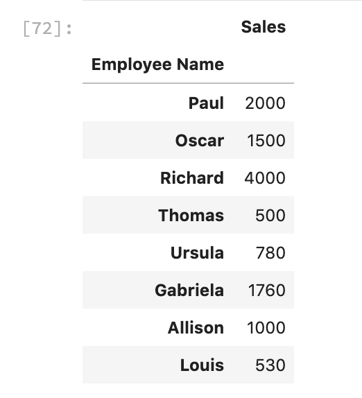
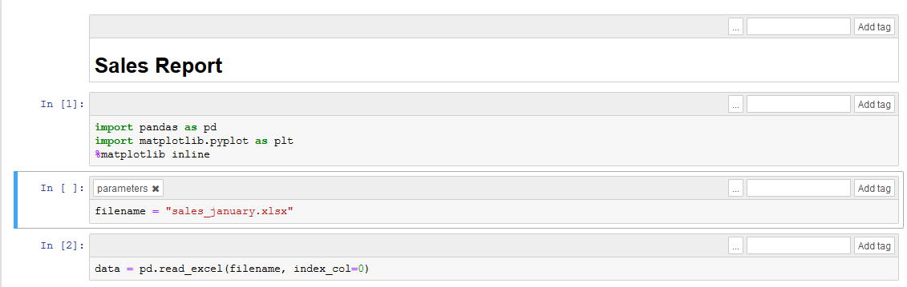
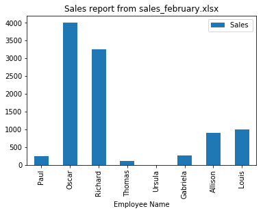

# Automating report generation with Papermill and Rclone

This is python 3.7 only (f strings and subprocess.run(capture_output))


## Automating report generation with Python

Not everyone can code. This might seem like an obvious statement, but once you start using python to automate or analyze things around you, you start to encounter a big problem: reproducability. By this I mean the fact that not everyone can/ knows how to run your scripts, use your tools, etc. 

Let us say you built a killer script. How exactly do you make someone who has never heard the word "python" use it? You could teach them python, but that would take a long time.

In this post, we will cover how you can automatically generate shareable html reports from any excel file using a combination of tools, centered around python.  

So sit tight, and let's get started. 

## Creating a jupyter notebook report from an excel file

Let us say you have an excel file (`sales_january.xlsx`) with a list of the sales generated by a group of employees. Just like this:

<br/>
<center>

</center>
<br/>

Let's start by using a jupyter notebook `sales_january.ipynb` to create a very simple analysis of that sales data. 

We start by importing the [pandas](https://pandas.pydata.org/) library. After that we define the name of our file using the `filename` variable. Finally, we use the `read_excel` function to read our data into a pandas dataframe. 

```python
import pandas as pd
import matplotlib.pyplot as plt
%matplotlib inline

filename = "sales_january.xlsx"
data = pd.read_excel(filename, index_col=0)
```
When printing the `data` dataframe, we get the following:

<br/>
<center>

</center>
<br/>

After that, we simply plot the data using: 

```python
data.plot(kind="bar", title=f"Sales report from {filename}")
```

And get the following:

<br/>
<center>

</center>
<br/>

And that's it! We got ourselves a jupyter notebook that analyzes (a very simple example here) a sales report in excel. Now let's say we want to share that report with other people in the organization, what do we do? 

notebook link!
[Browse the notebook here!]()


## Generating html reports from Jupyter Notebooks to share with colleagues

In my experience, the easiest way to share a report with colleagues is to use a little tool called [nbconvert](https://nbconvert.readthedocs.io/en/latest/). Nbconvert allows you to generate an html version of your notebook. To do this, start by navigating to the same directory where your notebook is and run the following from your terminal: 

```bash
$ jupyter nbconvert sales_january.ipynb
```
You will see a new file named `sales_january.html` was created. HTML files are better than `ipynb` in the measure that they are easily shareable via email, message, or any other way. 

But lets us say that this sales report comes in every month, how can we automatically run this notebook with any excel file in the same format? 

## Automating report generation using papermill

[Papermill](https://papermill.readthedocs.io/en/latest/) is a handy tool that allows us to "parameterize and execute" Jupyter Notebooks. This means that papermill allows you execute the same jupyter notebook, with different variables defined outside its context. 

To install it, run `pip install papermill`, or follow the more extensive [installation instructions](https://papermill.readthedocs.io/en/latest/installation.html).

Let us say we want to generate the same report as above, but with another excel file: `sales_february.xlsx`. You should have in your directory, the following:

```bash
├── sales_february.xlsx
├── sales_january.html
├── sales_january.ipynb
└── sales_january.xlsx
```

The first step is to parameterize our notebook, to do this, let us create a `template.ipynb` file. This notebook is very similar to `sales_january.ipynb` but with a small difference: a new cell with a tag `parameters`. Just like this:

<br/>
<center>

</center>
<br/>

(If you have trouble adding a tag to your notebook, visit [this link](https://papermill.readthedocs.io/en/latest/usage-parameterize.html#notebook))


The cell with the `parameters` tag, will basically allow you to run this notebook from another python script, while feeding the `filename` variable, any value you would like. 

Now that we have everything in place, let's generate a report for a new `february_sales.xlsx` excel file.

Your directory should look like this: 

```bash
├── sales_february.xlsx
├── sales_january.html
├── sales_january.ipynb
├── sales_january.xlsx
└── template.ipynb
```

To do this, in a new python file, or in your terminal, run the following:

```python
import papermill as pm

pm.execute_notebook(
   'template.ipynb',
   'sales_february.ipynb',
   parameters=dict(filename="sales_february.xlsx")
)
```

Let's brake this down: the `execute_notebook` takes 3 arguments. The first, `template.ipynb` is the name of the file what we will use as a base to run our notebook, the one with the `parameters` tag. The second argument, is the name of the new notebook that we will generate with the new arguments. Finally, `parameters` is a dictionnary of the variables that we want to impose to our template, in this case, the `filename` variable, will now point to our february sales report. 

When running the above code, you will notice a new file in your directory: 


```bash
├── sales_february.ipynb <- This one!
├── sales_february.xlsx
├── sales_january.html
├── sales_january.ipynb
├── sales_january.xlsx
└── template.ipynb
```

Which means, that Papermill has generated a new notebook for us, based on the `sales_february.xlsx`. When openning this notebook, we see a new graph with the new february numbers: 

<br/>
<center>

</center>
<br/>

This is pretty handy! We could have a continuous script that always runs this notebook with different sales reports from different months. But how can we automate the process even more? 

## A workflow to automatically generate reports in a shared cloud folder

Let's imagine you want to generate automatic reports for every similar excel file. Furthemore, you want to share them with your colleagues. Your colleagues are interested in the reports, but not learning to program python, how would you proceed? 

There are a lot of options, and hardly any incorrect ones, but one I found particularly interesting was using what we already had in a company: a cloud folder (Google Drive, OneDrive, Dropbox). 

Cloud folders are very popular in companies, particularly shared ones. So a good idea would be to create a shared folder where everyone can upload sales excel reports, and automatically generate `html` reports from them, so everyone can read!

Here is the basic architecture of the solution: 

<br/>
<center>

</center>
<br/>

Let's describe each one of the steps: 
- A user uploads a new excel sales report to a shared cloud folder.
- We sync the cloud folder with a local folder and detect that new excel sales report.
- We use papermill to generate a new notebook file from that new excel sales report. 
- We use nbconvert to generate an html file from that new notebook file. 
- We upload the html file to the cloud folder, so the user can read it.  

Let's start building this step by step: 

#### 1.Sync a cloud folder with a local folder and detect new files 
To sync cloud directories with local directories, we will a tool called [Rclone](https://rclone.org/). Of course we will integrate it with python.

Start by installing rclone in the same machine as your local folder (your personal computer or a virtual private server for example). On a Mac or linux: 

```bash
$ curl https://rclone.org/install.sh | sudo bash
```
On windows, download the executable in the [Rclone downloads page](https://rclone.org/downloads/). 

Once rclone is installed, we must configure it, depending on your cloud provider (Dropbox, Google Drive, OneDrive), the instructions will vary, so make sure the follow the [configuration instructions](https://rclone.org/).

Once configured, lets do a first sync from the command line: 

```bash
$ rclone sync remote:REMOTE_FOLDER_NAME LOCAL_FOLDER_NAME
```
This will sync your local folder with your remote folder. 

This can also easily be done from a python file using the core `subprocess` library. That allows you to run command line programs from python:

```python
import subprocess

# define our variables, or folder names. 
REMOTE_FOLDER_NAME="shared folder"
LOCAL_FOLDER="local folder"

# run the rclone sync command from python
subprocess.run(
        ["rclone", "sync", f"remote:{REMOTE_FOLDER_NAME}", LOCAL_FOLDER]
    )
```
Now that we know how to sync a local and a cloud directory, how do we detect if a user has uploaded a new file to our cloud directory? Well, an option would be to navigate to our local directory and use the `ls` command. Rclone also [allows us](https://rclone.org/commands/rclone_ls/) to list files in our cloud directory. Having this, we can create a python function that detects new files if they have been uploaded:

```python
def get_new_files(remote_folder, local_folder):
    """
    A function that returns files that were uploaded to the cloud folder and 
    do not exist in our local folder. 
    """
    # list the files in our cloud folder 
    list_cloud = subprocess.run(
        ["rclone", "lsf", f"remote:{remote_folder}"],
        capture_output=True,
        text=True,
    )
    
    # transform the command output into a list 
    cloud_directories = list_cloud.split("\n")[0:-1]

    print(f"In the cloud we have: \n{cloud_directories}")

    # list the files in our local folder 
    list_cloud = subprocess.run(
        ["ls", local_folder], capture_output=True, text=True
    )

    # transform the command output into a list
    local_directories = list_cloud.stdout.split("\n")[0:-1]

    print(f"In the local copy we have: \n{local_directories}")

    # create a list with the differences between the two lists above 
    new_files = list(set(cloud_directories) - set(local_directories))

    return new_files
```
A couple of notes about the script above: 
- The `capture_output` file in the `subprocess.run` function, allows us to capture the output of the command. The `text` flag allows us to treat everything as text, avoiding problems with spaces for example.
- After running `subprocess.run`, we apply the `.split` function, this is because the output of the `subprocess.run` function is a list of different files separated by a line break (`\n`). This split function allows us to but all the elements into a nicely formatted list. 
- The `new_files` list will contain only files that are in the cloud directory, but not in the local directory, or in other words: the excel file that users have uploaded to the cloud drive. In case there are no differences, the function will return an empty list. 

#### 2.Using Papermill and Nbconvert to generate new reports

Once we have a reliable way of detecting if new files are uploaded to the cloud, we now need to process that new file and generate an `html` report from it. 

To do this, we will use two of the tools mentioned in the first part of this article: papermill, and nbconvert. 

We start by creating a function that will create a new notebook file, based on an excel report. Using of course, a notebook template (as for example `template.ipynb`) as previously decribed. 

```python
import papermill as pm

def run_notebook(excel_report, notebook_template):
    # take only the name of the file, and ignore the .xlsx ending
    no_extension_name = excel_report.split(".")[0]
    # run with papermill
    pm.execute_notebook(
        notebook_template,
        f"{no_extension_name}.ipynb",
        parameters=dict(filename=excel_report),
    )
    return no_extension_name
```

Then, we must convert the notebook to an html file. To do this, we create another function that calls the `nbconvert` command from the python interpreter. 

```python
import subprocess

def generate_html_report(notebook_file):
    generate = subprocess.run(
        [
            "jupyter",
            "nbconvert",
            notebook_file,
            "--to=html",
        ]
    )
    print("HTML Report was generated")
    return True
```

This function runs the nbconvert command previously described in the beginning of the article, from a python script. 

#### 4.Uploading an html file back to the cloud folder

There is another Rclone command that is pretty handy. If you want to push a file from a local folder to a cloud folder, you can use the following from the command line:

```bash
$ rclone copy FILENAME remote:REMOTE_FOLDER_NAME
```

We could do it from the command line, but why not use it from python? With the subprocess library, it's pretty straighforward:


```python
import subprocess

def push_to_cloud(remote_folder, html_report):
    push = subprocess.run(
        ["rclone", "copy", html_report, f"remote:{remote_folder}"]
    )
    print("Report Published!!!")
```

#### 5.Bringing it all together
So finally, after giving you a rundown of all of the major tools and processes, the full script that scans the cloud folder for new excel sales reports, and generates and uploads an html analysis of them is presented. 

The script, `cloud_reporter.py` follows:

```python
import subprocess
import sys
import papermill as papermill


REMOTE_FOLDER = "your cloud folder name"
LOCAL_FOLDER = "your local folder name"
TEMPLATE_NOTEBOOK = "template_notebook.ipynb"


def get_new_files(remote_folder, local_folder):
    """
    A function that returns files that were uploaded to the cloud folder and 
    do not exist in our local folder. 
    """
    # list the files in our cloud folder
    list_cloud = subprocess.run(
        ["rclone", "lsf", f"remote:{remote_folder}"],
        capture_output=True,
        text=True,
    )

    # transform the command output into a list
    cloud_directories = list_cloud.split("\n")[0:-1]

    print(f"In the cloud we have: \n{cloud_directories}")

    # list the files in our local folder
    list_cloud = subprocess.run(
        ["ls", local_folder], capture_output=True, text=True
    )

    # transform the command output into a list
    local_directories = list_cloud.stdout.split("\n")[0:-1]

    print(f"In the local copy we have: \n{local_directories}")

    # create a list with the differences between the two lists above
    new_files = list(set(cloud_directories) - set(local_directories))

    return new_files


def sync_directories(remote_folder, local_folder):
    """
    A function that syncs a remote folder with a local folder
    with rclone. 
    """
    sync = subprocess.run(
        ["rclone", "sync", f"remote:{remote_folder}", local_folder]
    )

    print("Syncing local directory with cloud....")
    return sync.returncode


def run_notebook(excel_report, template_notebook):
    """
    A function that runs a notebook against an excel report
    via papermill. 
    """
    no_extension_name = excel_report.split(".")[0]
    papermill.execute_notebook(
        template_notebook,
        f"{no_extension_name}.ipynb",
        parameters=dict(filename=excel_report),
    )
    return no_extension_name


def generate_html_report(notebook_file):
    """
    A function that converts a notebook into an html
    file. 
    """
    generate = subprocess.run(
        ["jupyter", "nbconvert", notebook_file, "--to=html"]
    )
    print("HTML Report was generated")
    return True


def push_to_cloud(remote_folder, filename):
    """
    A function that pushes to a remote cloud folder
    a specific file. 
    """

    push = subprocess.run(
        ["rclone", "copy", filename, f"remote:{remote_folder}"]
    )
    print("Report Published!!!")

def main():
    print("Starting updater..")

    # detect if there are new files in the remote folder
    new_files = get_new_files(
        remote_folder=REMOTE_FOLDER, local_folder=LOCAL_FOLDER
    )

    # if there are none, exit
    if not new_files:
        print("Everything is synced. No new files.")
        sys.exit()
    # else, continue
    else:
        print("There are files missing.")
        print(new_files)

    # sync directories to get new excel report
    sync_directories(remote_folder=REMOTE_FOLDER, local_folder=LOCAL_FOLDER)

    # generate new notebook and extract the name
    clean_name = run_notebook(new_files[0])

    # the new notebook generate will have the following name
    notebook_name = f"{clean_name}.ipynb"

    # generate the html report from the notebook
    generate_html_report(notebook_name)

    # the notebook name will be the following
    html_report_name = f"{clean_name}.html"

    # push the new notebook to the cloud
    push_to_cloud(html_report=html_report_name, remote_folder=ONEDRIVE_FOLDER)

    # make sure everything is synced again
    sync_directories(remote_folder=REMOTE_FOLDER, local_folder=LOCAL_FOLDER)

    print("Updater finished.")

    return True


if __name__ == "main":
    main()
```

#### 6.Running the updater regularly

Once you get the script running, one option is to copy it to a virtual private server (digital ocean link) and have it run regulary via something like `cron`. 

You should [read more about `cron`](https://www.ostechnix.com/a-beginners-guide-to-cron-jobs/) before messing with it, but a basic approach would be:

1. Make sure the script is running successfully in your server by:
    - Installing and configuring rclone.
    - Installing jupyter and nbconvert.
    - Creating a local folder to serve as a remote copy.
    - Modifying the script above with your variables (base notebook, remote folder name, and local folder name).
    - Making sure the script runs.

2. Editing your crontab by doing:

```bash
$ crontab -e
```

3. Adding a crontab job that navigates to a certain directory and runs the `cloud_reporter.py` file, every X minutes. 

Here an example of it running every 4 minutes:

```bash
*/4 * * * * python /path/to/your/folder/cloud_reporter.py
```

4. Upload a new excel file to your cloud folder and wait a minimum of 4 minutes, and a new html report shoud be generated!


ENDING NOTES....